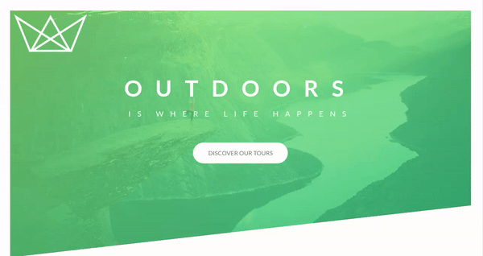

<h1 align="center">Natours Website</h1>

<h2 align="center">Project made using advanced CSS techniques</h2>

  

Classes here:

[Advanced CSS and Sass: Flexbox, Grid, Animations and More!](https://www.udemy.com/course/advanced-css-and-sass/)

